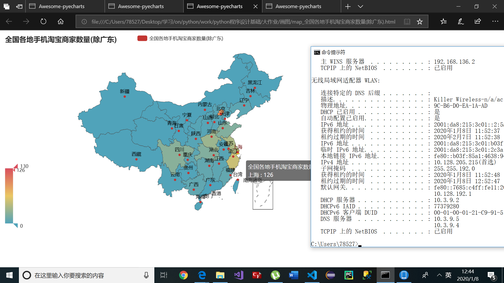

# <center><strong>python“Python 程序设计”课程大作业 </center></strong></center></strong>
<center>姓名：邹瀚影 学号：2017211012 班级：2017211303</center>

## <center><strong>任务1：分别爬取京东和淘宝，在手机频道中，找出累积销量（所有商家销售同一型号手机的销量之和）最高的 20 款手机。</center></strong>
---
+ 要求：
   + 销量：京东以评论数为准，淘宝以付款人数为准。 
   + 基础版本：一款手机只看最低配置和最低价格，例如 iPhone 11 只按照 64G 的价格来计算。高级版本：一款手机有多个型号，不同的配置算不同的型号，例如 iPhone 11 64G 算是一种型号，128G 算另一种型号。按照自己的能力选做基础版本或者是高级版本，高级版本有加分。 
---
+ 京东爬虫
对于京东采用的是首页使用selenium进行翻页，爬取的起始页面是京东搜索“手机”后以销量排行。  
  
在商品的每一页都可以获得商品的链接（一页有60个）。然后用requests来获取每个商品详细内容的html,如下图：
  
找到了可以用的json，并且发现不同配置的手机其skuId不同，且与相应网址对应，但是这里对于不同颜色等也算为不同配置，所以之后需要对数据进行处理。  
关于获得不同商品的评论，发现在某商品页面点评论时会传来包：  
  
接下来还剩下不同配置商品的价格了，发现html里也没有，但是百度了一下发现了一个接口：
http://p.3.cn/prices/mgets?type=1&skuIds=  
只要在最后加上商品的skuId就能得到商品的价格。感谢jd。

+ 京东爬虫的代码如下：
```python
from lxml import etree
from selenium import webdriver
from time import sleep
import pandas as pd
import numpy as np
import re
import csv
import requests
import json

# with open('data_jd_a.csv', 'w',encoding='utf-8',newline='') as csvfile:
#     wr = csv.writer(csvfile)
#     wr.writerow(['title','store','type', 'sells', 'price','skuid'])

def get_sells_price(skuId):
    headers = {
        "referer": "https://item.jd.com/{}.html".format(skuId),
        "user-agent": 'Mozilla/5.0 (Windows NT 6.1) AppleWebKit/537.2 (KHTML, like Gecko) Chrome/22.0.1216.0 Safari/537.2'#在网上找了个user-agent
    }

    url = "https://club.jd.com/comment/skuProductPageComments.action?callback=fetchJSON_comment98vv25215&productId={}&score=0&sortType=5&page=0&pageSize=1&isShadowSku=0&fold=1".format(skuId)
    res = 0
    while res==0:
        try:
            res = requests.get(url,headers=headers)
        except Exception as err:
            print('get sells fail')
            sleep(1)
            
    get_txt = res.text[27:-2]
    s_dic = json.loads(get_txt)
    res =0
    while res ==0:
        try:
            res = requests.get('http://p.3.cn/prices/mgets?type=1&skuIds={}'.format(skuId))
        except Exception as err:
            print('get price fail')
            sleep(1)
    js = res.text[1:-2]
    p_dic = json.loads(js)
    return s_dic["productCommentSummary"]["commentCount"],p_dic['p']

def get_info(url,title,store,page,num):
    print('开始爬取第{}页，第{}个商品'.format(page,num))
    res = 0
    t_type=0
    sucess = True
    while res==0:
        try:
            res = requests.get(url)
        except Exception as err:
            print('第{}页，第{}个商品，获取失败'.format(page,num))
            sleep(1)
    res.encoding = 'gbk'
    try:
        temp = re.findall('(?<=pageConfig =)[\s\S]*?(?=try)',res.text)
        ttemp = re.findall('colorSize: \[([\s\S]*?)\],',str(temp[0]))
        ttemp = re.findall('\{.*?\}',ttemp[0])
    except Exception as err:
        print('第{}页，第{}个商品，解析失败因为'.format(page,num),err)
        sucess = False
    if sucess:
        for _ in ttemp:
            t_dic = json.loads(_)
            t_dic['title'] = title
            t_dic['store'] = store
            t_dic['sells'],t_dic['price'] = get_sells_price(t_dic['skuId'])
            try:
                t_type = t_dic['选择版本']
            except Exception as err:
                try:
                    t_type = t_dic['版本']
                except Exception as err2:
                    print(err2)
                    t_type=''
            with open('test.csv', 'a+', encoding='utf-8', newline='') as csvfile:
                wr = csv.writer(csvfile)
                wr.writerow([title, store,t_type,t_dic['sells'],t_dic['price'],t_dic['skuId']])

brow = webdriver.Chrome()
brow.get('https://search.jd.com/Search?keyword=%E6%89%8B%E6%9C%BA&enc=utf-8&qrst=1&rt=1&stop=1&vt=2&wq=%E6%89%8B%E6%9C%BA&psort=3&click=0')

for page in range(1,51):  # 爬取50页
    print('正在爬第{}页'.format(page))
    js = 'document.documentElement.scrollTop = document.documentElement.scrollHeight * %f' % 0.9
    brow.execute_script(js)
    sleep(2)
    js = 'document.documentElement.scrollTop = document.documentElement.scrollHeight * %f' % 0.9
    #京东每页的后半部分都需要加载
    brow.execute_script(js)
    sleep(4)
    html_source = brow.page_source  # 抽取网页源码
    dom = etree.HTML(html_source)  # 解析为DOM型
    for _ in range(1,61):
        try:
            title = dom.xpath(('//*[@id="J_goodsList"]/ul/li[{}]/div/div[4]/a/em/text()[1]').format(_))
            store = dom.xpath(('//*[@id="J_goodsList"]/ul/li[{}]/div/div[7]/span/a/text()').format(_))
            link = brow.find_element_by_xpath(('//*[@id="J_goodsList"]/ul/li[{}]/div/div[4]/a').format(_)) 

            if(title and store and link):
                t_url = link.get_attribute('href')
                get_info(t_url,title,store,page,_)
            else:
                print('第{}页第{}号商品错误'.format(page,_))
                html_source = brow.page_source  # 抽取网页源码
                dom = etree.HTML(html_source)  # 解析为DOM型
        except Exception as err:
            print('第{}页第{}号商品定位错误'.format(page,_))
            print(err)
            html_source = brow.page_source  # 抽取网页源码
            dom = etree.HTML(html_source)  # 解析为DOM型
    try:
        next_page = brow.find_element_by_class_name('pn-next')
        next_page.click()
        sleep(1.5)
    except Exception as err:
        print('page +1 fail')
        break

print('finish')
brow.quit()
```
爬取的结果如下：


+ 淘宝爬虫  
淘宝的商品信息太乱，不同配置的销售量也没办法确定，所以没有考虑不同配置的情况。具体方法是使用selenium进行手机页面的翻页，所有的信息均从页面html解析进行正则匹配得到数据。（最开始以首页的收货人数作为标准，但是处理数据的时候发现太不靠谱了。解析html后决定采用commentcount作为标准，且每页数量都是44）  
!  
+ 淘宝爬虫代码如下：
```python
from lxml import etree
from selenium import webdriver
from time import sleep
import pandas as pd
import numpy as np
import re
import csv
import random
import json
from selenium.webdriver.common.keys import Keys

# with open('data_tb3.csv', 'a+', encoding='utf-8', newline='') as csvfile:
#     wr = csv.writer(csvfile)
#     wr.writerow(['title', 'price', 'store','commentcount','location'])

brow = webdriver.Chrome()
brow.get('https://s.taobao.com/search?q=%E6%89%8B%E6%9C%BA&imgfile=&commend=all&ssid=s5-e&search_type=item&sourceId=tb.index&spm=a21bo.2017.201856-taobao-item.1&ie=utf8&initiative_id=tbindexz_20170306&sort=sale-desc')
o_html = 0
o_title_list = []

for page in range(1,101):  # 爬取100页
    #翻页面是为了让我看到当前是第几页。。不翻也没关系
    js = 'document.documentElement.scrollTop = document.documentElement.scrollHeight * %f' % 0.5
    brow.execute_script(js)
    sleep(2)
    js = 'document.documentElement.scrollTop = document.documentElement.scrollHeight * %f' % 0.8
    brow.execute_script(js)
    sleep(4)
    sleep(random.randint(30,60))
    print('开始爬第{}页'.format(page))
    html_source = brow.page_source  # 抽取网页源码
    try:
        with open('html\html_{}.txt'.format(page),'w+',encoding='utf-8') as f:
            f.write(html_source)
    except Exception as err:
        print(err)
    if o_html == html_source:
        print('第{}页 html_source fail.quit'.format(page))
        # break
    o_html = html_source
    e_html = etree.HTML(html_source)
    
    title_list = re.findall('"raw_title":(.*?),',html_source,re.S)
    price_list = re.findall('"view_price":"(.*?)"',html_source,re.S)
    store_list = re.findall('"nick":(.*?),',html_source,re.S)
    commentcount_list = re.findall('"comment_count":"(.*?)"',html_source,re.S)
    location_list = re.findall('"item_loc":"(.*?)"',html_source,re.S)
    if o_title_list == title_list:
        with open('log.txt','a+',encoding='utf-8') as logf:
            logf.write('第{}页 content fail.\n'.format(page))
        print('第{}页 content fail.quit'.format(page))
        
    elif (len(title_list) == len(price_list)) and (len(price_list)==len(commentcount_list)):
        try:
            with open('data_tb3.csv', 'a+', encoding='utf-8', newline='') as csvfile:
                wr = csv.writer(csvfile)
                for i in range(44):  
                    wr.writerow([title_list[i],price_list[i],                    store_list[i],commentcount_list[i],location_list[i]])
            print('第{}页写入完成'.format(page))
        except Exception as err:
            print('第{}页写入失败因为{}\n'.format(page,err))
            with open('log.txt','a+',encoding='utf-8') as logf:
                logf.write('第{}页写入失败因为{}\n'.format(page,err))
                a = 'tit len :'+str(len(title_list))+'\npri len :'+str(len(price_list))+'\nsto len :'+str(len(store_list))+'\ncom len :'+str(len(commentcount_list))
                logf.write(a+'\n')
    else:
        with open('log.txt','a+',encoding='utf-8') as logf:
            logf.write('第{}页写入失败因为数据数量不对\n'.format(page))
            print('第{}页写入失败因为数据数量不对\n'.format(page))

    o_title_list = title_list
    next_page = brow.find_element_by_xpath('//*[@id="mainsrp-pager"]/div/div/div/div[2]/span[3]').send_keys(Keys.ENTER)
    sleep(random.randint(32,60))
    #这里翻页后必须重新geturl，否则得到的html还是之前页面的
    cur_url = brow.current_url
    brow.get(cur_url)
brow.quit()
```
有很多输出信息以及log是因为最开始的时候经常有错误。处理信息时才发现得了大量重复的内容，最后查了好长时间发现是翻页后得到的html与页面显示的不同，还是之前的html。代码修改好后基本不会有问题。  
爬取的结果如下：

 

---
+ 数据处理部分
对数据的处理分为对京东数据的处理和对淘宝数据的处理  
+ 对京东数据的处理
    + 1.合并同商家同类型的手机（去除套餐、颜色等因素，仅保留配置不同）。销量取和，价格取平均值。  
    具体处理代码如下：
    ```python
    orig_df = pd.read_csv('data_jd_a.csv',encoding='utf-8')
    temp_p = round(orig_df.groupby(['title','store','type']).mean(),2)
    temp_s = orig_df.groupby(['title','store','type']).sum()#为了得到销量和
    temp_p['sells'] = temp_s['sells']#销量取和
    temp_p.to_csv('jd_result1_groupby.csv')
    ```
    + 2.对得到的数据以销量排序，代码如下：
    ```python
    df = pd.read_csv('result1_groupby.csv',encoding='utf-8')
    df.sort_values('sells',ascending = False,inplace=True)
    df.to_csv('result2_order.csv')
    ```
    + 3.通过对商品的title对商品的品牌和类型进行规格化。这里尝试了很多方法，也用jieba提取过title中出现频率高的词，但是发现频率高的次都是形容词，与品牌相关的非常少，且品牌出现频次高也不一定代表销量高。所以就先在网上找了一份销量排行的手机机型，如下代码中的brand_list和brand_dic,再通过分类后，看没有被规格化的品牌的销量是否很高，若值得被规格化，则再将其相关信息添加到brand_list和brand_dic中。规格化的过程是对每个title先在brand_list中找，看title是否包含某个品牌。再通过brand_dic来找对应的型号。（这里匹配型号的时候采用忽略空格以及大小写。同时还要注意brand_list和brand_dic中词汇的先后顺序，如一个手机的标题为“索尼3000万像素 小米XXX手机”，则会先匹配到索尼则将手机计入索尼，所以要将小米放在比索尼更前面的位置，以及'iphonexr'要放在'iphonex'前面等）
    ```python
    un_pro = pd.DataFrame(columns = ('title','store','type','sells','price'))#记录没被规格化的数据
    done_pro = pd.DataFrame(columns = ('title','store','type','sells','price'))#记录被规格化的数据
    df = pd.read_csv('jd_result2_order.csv')

    def proc(_t,line,title):
        global df,un_pro,done_pro

        if _t == 'done':
            dic_t = {'title':title,'store':df.iloc[line][2],'type':df.iloc[line][3],'sells':df.iloc[line][4],'price':df.iloc[line][5]}
            df_temp = pd.DataFrame(dic_t,index=[0])
            done_pro = done_pro.append(df_temp,ignore_index=True)
        elif _t == 'un':
            dic_t = {'title':df.iloc[line][1],'store':df.iloc[line][2],'type':df.iloc[line][3],'sells':df.iloc[line][4],'price':df.iloc[line][5]}
            df_temp = pd.DataFrame(dic_t,index=[0])
            un_pro = un_pro.append(df_temp,ignore_index=True)
        
    brand_list = ['apple','redmi','苹果','飞利浦','oppo','huawei','荣耀','华为','vivo','三星','努比亚','锤子','一加','魅族','联想','诺基亚','天语','真我','中兴','黑鲨','红米','小米','lg','海信','索尼','美图']
    brand_dic = {'apple':['iphonexr','iphonexsmax','iphonexs','iphonex','iphone8plus','iphone8','iphone7','iphone7plus','iphone11promax','iphone11'],
                '苹果':['iphonexr','iphonexsmax','iphonexs','iphonex','iphone8plus','iphone8','iphone7','iphone7plus','iphone11promax','iphone11'],
                'huawei':['p30','mate20x','mate20pro','mate30pro','mate20','mate30','nova4','nova5pro','nova5','畅享9plus','畅享9','麦芒8','畅享8','nova3i','畅享10plus','nova6'],
                '华为':['p30','mate20x','mate20pro','mate30pro','mate20','nova4','mate30','nova5pro','nova5','畅享9plus','畅享9','麦芒8','畅享8','nova3i','畅享10plus','nova6'],
                'oppo':['findx','r17pro','r17','a9','a5','reno10','renoz','reno','a9x','k5','k3','k1'],
                '荣耀':['v20','v30','20pro','8x','20i','10','20','9x','9i','magic2'],
                'vivo':['iqoo','x27pro','x27','z5x','u1','u3x','s1pro','s1','z3x','z3','z5'],
                '努比亚':['红魔3','红魔','x','9pureview','z18'],
                '锤子':['坚果pro2s','坚果r1','坚果pro3'],
                '飞利浦':['e106','e517'],
                '一加':['6t','7pro','7'],
                '魅族':['16xs','16x','16','x8','note8','note9'],
                '三星':['galaxys10+','galaxynote10','galaxys10','galaxya60','galaxya70'],
                '索尼':['xperiaxz3'],
                '联想':['z5pro','z5','xperia10plus'],
                '诺基亚':['x71','x7'],
                'lg':['v50','v40'],
                '真我':['x','真我q'],
                '海信':['小海豚','a6'],
                '天语':['q30','s8'],
                '美图':['t9'],
                '中兴':['bladea7','axon10pro','bladev10'],
                '红米':['k20pro','k20','note7pro','7a','7','8a','note8'],
                'redmi':['note8','k20pro','k20','note7pro','7a','7','8a'],
                '小米':['小米9se','小米9','mix3','小米8','cc9','mix2s','max3'],
                '黑鲨':['']
                }
    no_brand = 0
    no_type = 0

    for line in range(len(df)):
        t_title = df.iloc[line][1]
        for brand in brand_list:
            if brand in t_title.lower():
                for _type in brand_dic[brand]:
                    if _type in t_title.replace(' ','').lower():#忽略空格和大小写
                        if brand == '苹果':
                            brand = 'apple'
                        elif brand == 'huawei':
                            brand = '华为'
                        elif brand == 'redmi':
                            brand = '红米'
                        t_title = brand+'+'+_type
                        proc('done',line,t_title)
                        break
                else:
                    no_type+=1
                    proc('un',line,0)
                break
        else:
            no_brand +=1
            proc('un',line,0)
    print('no_brand:',no_brand)
    print('no_type:',no_type)
    un_pro.to_csv('not_pro.csv')
    done_pro.to_csv('done_pro.csv')
    ```
    输出如下：

    可以看到有167个title没有找到对应的品牌。有1447个title没有找到对应的手机型号。  
    规格化后的数据内容如下：

    没有被规格化的数据内容如下：

    可以看到没有被规格化的手机除了老年机销量都不算高，而规格化的数据的销量20位已经是接近30万销量的水平了，所以就不再对brand_list和brand_dic进行增加了。（实际实验时根据处理结果对brand_list和brand_dic的内容进行了调整）
    + 4.对所有商家的数据以手机名字和配置分类排名（销量取总和，价格取平均值）。  
    代码如下：
    ```python
    done_pro = pd.read_csv('done_pro.csv',encoding='utf-8')
    result_p = round(done_pro.groupby(['title','type']).mean(),2)
    result_s = done_pro.groupby(['title','type']).sum()
    result_p['sells'] = result_s['sells']
    result_p.sort_values('sells',ascending = False,inplace=True)
    result_p.to_csv('jd_result3_final.csv')
    ```
    得到的结果如下：

    这也是京东最后以手机配置进行销量排行的最终结果。
    + 5.得到各个品牌不同机型所有的销售量（为了之后与淘宝统一对比，即不考虑类型如64GB或32GB等规格）  
    代码如下：
    ```python
    df = pd.read_csv('done_pro.csv',encoding='utf-8')
    result_p = round(df.groupby(['title']).mean(),2)
    result_s = df.groupby(['title']).sum()
    result_p['sells'] = result_s['sells']
    result_p.sort_values('sells',ascending = False,inplace=True)
    result_p.to_csv('jd_result4_brand.csv')
    ```
    得到结果如下：

+ 对淘宝数据处理
    + 1.去掉爬取数据时商家的多余的"符号（虽然title也有多余的"但是因为之后会规格化，所以这一步没有进行处理）并以销量（commet_count）进行排行。  
    代码如下：
    ```python
    df = pd.read_csv('data_tb3.csv',encoding='utf-8')
    for line in range(len(df)):
        df.iloc[line,2] = df.iloc[line,2].replace('\"','')
    df.sort_values('commentcount',ascending = False,inplace=True)
    df.to_csv('tb_result1_pre.csv')
    ```
    得到的结果如下：

    + 2.规格化title，具体过程与京东规格的过程类似，brand_list和brand_dic会因为数据的不同而有所改变。 
    代码如下：
    ```python
    un_pro = pd.DataFrame(columns = ('title','store','sells','price'))
    done_pro = pd.DataFrame(columns = ('title','store','sells','price'))
    df = pd.read_csv('tb_result1_pre.csv',encoding='utf-8')
    def proc(_t,line,title):
        global df,un_pro,done_pro
        if _t == 'done':
            dic_t = {'title':title,'store':df.iloc[line,3],'sells':df.iloc[line,4],'price':df.iloc[line,2]}
            df_temp = pd.DataFrame(dic_t,index=[0])
            done_pro = done_pro.append(df_temp,ignore_index=True)
        elif _t == 'un':
            dic_t = {'title':df.iloc[line,1],'store':df.iloc[line,3],'sells':df.iloc[line,4],'price':df.iloc[line,2]}
            df_temp = pd.DataFrame(dic_t,index=[0])
            un_pro = un_pro.append(df_temp,ignore_index=True)
        
    brand_list = ['创星','apple','redmi','苹果','飞利浦','oppo','huawei','荣耀','华为','vivo','三星','努比亚','锤子','一加','魅族','联想','诺基亚','天语','真我','中兴','黑鲨','红米','小米','lg','海信','索尼','美图','纽曼','尼凯恩',]
    brand_dic = {'apple':['iphonexr','iphonexsmax','iphonexs','iphonex','iphone8plus','iphone8','iphone7plus','iphone7','iphone11promax','iphone11','iphone6plus','iphone6'],
                '苹果':['iphonexr','iphonexsmax','iphonexs','iphonex','iphone8plus','iphone8','iphone7plus','iphone7','iphone11promax','iphone11','iphone6plus','iphone6'],
                'huawei':['p30','mate20x','mate20pro','mate30pro','mate20','mate30','nova4','nova5pro','nova5','畅享9plus','畅享9','麦芒8','畅享8','nova3i','畅享10plus','nova6'],
                '华为':['p30','mate20x','mate20pro','mate30pro','mate20','nova4','mate30','nova5pro','nova5','畅享9plus','畅享9','麦芒8','畅享8','nova3i','畅享10plus','nova6'],
                'oppo':['findx','r17pro','r17','a9','a5','reno10','renoz','reno','a9x','k5','k3','k1'],
                '荣耀':['v20','v30','20pro','8x','20i','10','20','9x','9i','magic2'],
                'vivo':['iqoo','x27pro','x27','z5x','u1','u3x','s1pro','s1','z3x','z3','z5'],
                '努比亚':['红魔3','红魔','x','9pureview','z18'],
                '锤子':['坚果pro2s','坚果r1','坚果pro3'],
                '飞利浦':['e106','e517'],
                '一加':['6t','7pro','7'],
                '纽曼':['m560','l8s',''],
                '创星':['s1'],
                '尼凯恩':['en3',''],
                '魅族':['16xs','16x','16','x8','note8','note9'],
                '三星':['galaxys10+','galaxynote10','galaxys10','galaxya60','galaxya70'],
                '索尼':['xperiaxz3'],
                '联想':['z5pro','z5','xperia10plus'],
                '诺基亚':['x71','x7'],
                'lg':['v50','v40'],
                '真我':['x','真我q'],
                '海信':['小海豚','a6'],
                '天语':['q30','s8','r7'],
                '美图':['t9'],
                '中兴':['bladea7','axon10pro','bladev10'],
                '红米':['k20pro','k20','note7pro','7a','7','8a','note8'],
                'redmi':['note8','k20pro','k20','note7pro','7a','7','8a'],
                '小米':['小米9se','小米9','mix3','小米8','cc9','mix2s','max3'],
                '黑鲨':['']
                }
    no_brand = 0
    no_type = 0
    for line in range(len(df)):
        t_title = df.iloc[line,1]
        for brand in brand_list:
            if brand in t_title.lower():
                for _type in brand_dic[brand]:
                    if _type in t_title.replace(' ','').lower():
                        if brand == '苹果':
                            brand = 'apple'
                        elif brand == 'huawei':
                            brand = '华为'
                        elif brand == 'redmi':
                            brand = '红米'
                        t_title = brand+'+'+_type
                        proc('done',line,t_title)
                        break
                else:
                    no_type+=1
                    proc('un',line,0)
                break
        else:
            no_brand +=1
            proc('un',line,0)
            ignore_index=True)
    print('no_brand:',no_brand)
    print('no_type:',no_type)
    un_pro.to_csv('tb_not_pro.csv')
    done_pro.to_csv('tb_done_pro.csv')
    ```
    规格化后的数据内容如下：

    没有被规格化的数据内容如下：

    + 3.淘宝数据以规格化后的手机分类并排名（销量取总和，价格取平均值）。  
    代码如下：
    ```python
    df = pd.read_csv('tb_done_pro.csv',encoding='utf-8')
    temp_p = round(temp.groupby('title').mean(),2)#价格取平均值
    temp_s = temp.groupby('title').sum()#sells记总数
    temp_p['sells'] = temp_s['sells']#sells记总数
    temp_p.sort_values('sells',ascending = False,inplace=True)
    temp_p.to_csv('tb_result2_final.csv')
    ```
    得到的数据内容如下：

    这也是最终画直方图需要的数据。
+ 画直方图
利用得到的信息，进行直方图的绘制
  + 首先单独绘制京东对不同配置的直方图（淘宝的信息没有分配置）  
  代码如下：
  ```python
  font = {
          'size'   : 8,  
          }  
  plt.rcParams['font.sans-serif'] = ['SimHei']
  fig,ax=plt.subplots()
  ax.set_title('京东销量图（不同配置）')

  df_jd = pd.read_csv('jd_result3_final.csv',encoding='utf-8')
  jd_sells = df_jd.iloc[0:20,3]
  jd_title = df_jd.iloc[0:20,0]
  jd_type = df_jd.iloc[0:20,1]
  sells_list = jd_sells.values.tolist()
  sells_list.reverse()
  title_list = jd_title.values.tolist()
  title_list.reverse()
  type_list = jd_type.values.tolist()
  type_list.reverse()
  x = np.arange(0,20,1)
  plt.bar(x,sells_list,width=0.8)
  for i in range(len(x)):#在直方图上显示销量
      plt.text(x[i]-0.5,sells_list[i]+0.5,'%d'%sells_list[i],fontsize=8)
      title_list[i]+=type_list[i]#将标题加上配置
      title_list[i] = title_list[i].replace('apple','').replace('iphone','iph').replace('+','').replace(' ','').replace('全网通','')

  print(title_list)
  plt.xlabel('机型')
  plt.ylabel('销量')
  ax.set_xticks(x+1)
  ax.set_xticklabels(title_list,rotation=330,fontdict=font)

  plt.show()
  ```
  得到的图如下:

+ 由图分析可知京东上算上配置，iphone xr 128GB版本是销量最高的，达到了158万多。京东上排行除了大家熟知的iphone，荣耀的各个型号与版本的销售量也很高，最高的是荣耀 8x全网通（4GB 8GB）版本，它的平均售价位1324，销售量高达151万多，仅次于128GB版本的iphone xr。
  + 绘制京东和淘宝的销售图（只以手机型号进行分类，没有考虑配置）  
  代码如下：
  ```python 
  font = {
          'size'   : 8,  
          }  
  plt.rcParams['font.sans-serif'] = ['SimHei']
  fig = plt.figure()
  plt.rcParams['font.sans-serif'] = ['SimHei']
  df_jd = pd.read_csv('jd_result4_brand.csv',encoding='utf-8')
  df_tb = pd.read_csv('tb_result2_final.csv',encoding='utf-8')
  ax1=fig.add_subplot(121)

  ax1.set_title('京东销量图')
  jd_sells = df_jd.iloc[0:20,2]
  jd_title = df_jd.iloc[0:20,0]
  sells_list = jd_sells.values.tolist()
  sells_list.reverse()
  title_list = jd_title.values.tolist()
  title_list.reverse()
  x = np.arange(0,20,1)
  plt.bar(x,sells_list,width=0.8)
  for i in range(len(x)):#在直方图上显示销量
      plt.text(x[i]-0.5,sells_list[i]+0.5,'%d'%sells_list[i],fontsize=8)
      title_list[i] = title_list[i].replace('apple','').replace('iphone','iph').replace('+','').replace(' ','').replace('全网通','')
  ax1.set_xlabel('机型')
  ax1.set_ylabel('销量')
  ax1.set_xticks(x+1)
  ax1.set_xticklabels(title_list,rotation=330,fontdict=font)

  ax2=fig.add_subplot(122)
  ax2.set_title('淘宝销量图')
  tb_sells = df_tb.iloc[0:20,1]
  tb_title = df_tb.iloc[0:20,0]
  sells_list = tb_sells.values.tolist()
  sells_list.reverse()
  title_list = tb_title.values.tolist()
  title_list.reverse()
  plt.bar(x,sells_list,width=0.8)
  for i in range(len(x)):#在直方图上显示销量
      plt.text(x[i]-0.5,sells_list[i]+0.5,'%d'%sells_list[i],fontsize=8)
      title_list[i] = title_list[i].replace('apple','').replace('iphone','iph').replace('+','').replace(' ','').replace('全网通','')
  plt.xlabel('机型')
  plt.ylabel('销量')
  ax2.set_xticks(x+1)
  ax2.set_xticklabels(title_list,rotation=330,fontdict=font)
  plt.show()
  ```
  得到的图如下:

  单独看图如下：

+ 由图分析可知在不算规格的情况下，京东上荣耀10销量排行第一，高达271万+，且前20大部分都被华为和苹果两个品牌的手机占据（把荣耀也算为华为的品牌），可见国民还是对这两个品牌认可度更高。而淘宝中销量最高的是荣耀 8x销量为接近50万，这款手机在京东中排行为第二，所以认为数据大致合理，排行第二为一款名为“纽曼”的老年机，销量为44万+。可以看到在淘宝中前20的手机中有一半为iphone和华为的手机，剩下的还有一些老年机。总的看来，从京东上iphone的销量更高且占据销售榜高位，而淘宝老年机占据前20的高位，可以得出京东的受众更倾向高端手机而淘宝的受众更倾向性价比或低价的老年机。

---
## <center><strong>任务2：用你爬取下来的数据制作散点图，横轴为手机价格，纵轴为该价格对应的商家个数。 </center></strong>
+ 一个 figure 中有 2 个子图，2 个子图分别展示京东和淘宝中，手机价格的分布情况。   
一共画了四个子图，前两个分别为淘宝京东数不经处理混合后的数据，淘宝京东数据处理后（修改异常值）混合的数据。后两个分别为京东、淘宝手机价格的分布（修改异常值后）。
代码如下：  
```python
def count_elements(scores): #定义转换函数，统计每个数值对应多少个
    scorescount = {}  #定义一个字典对象
    for i in scores:
        scorescount[int(i[0])] = scorescount.get(int(i[0]), 0) + 1 #累加每个整数数值的个数
    return scorescount
df_tb = pd.read_csv('data_tb3.csv',encoding='utf-8',usecols=[1])
df_jd = pd.read_csv('data_jd_a.csv',encoding='utf-8',usecols=[4])
result = pd.concat([df_jd,df_tb])#未处理的数据
price_list = result.values.tolist()
#修改异常值

mean_tb = np.mean(df_tb['price'])
std_tb = np.std(df_tb['price'])
max_tb = mean_tb+3*std_tb
min_tb = mean_tb -3*std_tb
df_tb.loc[df_tb['price']>max_tb,'price'] = max_tb
df_tb.loc[df_tb['price']<min_tb,'price'] = min_tb
mean_jd = np.mean(df_jd['price'])
std_jd = np.std(df_jd['price'])
max_jd = mean_jd+3*std_jd
min_jd = mean_jd -3*std_jd
df_jd.loc[df_jd['price']>max_jd,'price'] = max_jd
df_jd.loc[df_jd['price']<min_jd,'price'] = min_jd
result_stand = pd.concat([df_jd,df_tb])#处理后的数据
tb_list = df_tb.values.tolist()
jd_list = df_jd.values.tolist()
price_stand_list = result_stand.values.tolist()
count_dic_list = []
count_dic_list.append(count_elements(price_list))
count_dic_list.append(count_elements(price_stand_list))
count_dic_list.append(count_elements(tb_list))
count_dic_list.append(count_elements(jd_list))
fig = plt.figure()
ax1 = fig.add_subplot(221)
ax2 = fig.add_subplot(222)
ax3 = fig.add_subplot(223)
ax4 = fig.add_subplot(224)
axes = [ax1,ax2,ax3,ax4]

axes[0].set_title('京东淘宝混合图')
axes[1].set_title('京东淘宝混合图(修改异常值)')
axes[2].set_title('淘宝(修改异常值)')
axes[3].set_title('京东(修改异常值)')
for i in range(4):
    for x,y in count_dic_list[i].items():
        axes[i].scatter(x,y,color= 'b',alpha = 0.5)
plt.show()
```
最后得到的结果如下：

从图中可以看出淘宝中手机价格超过6000就算异常值了，而京东超过10000才算异常值，可知淘宝中手机价格都偏低，且从分布可以看出京东上销售高价格手机的店家更多。

---
## <center><strong>任务3：找出在两个平台上都有售卖的 5 款手机（找销量较大的） ，由于两个平台上都有不同的卖家都销售这些手机，价格也不同，需要将这些卖家销售这款手机的价格，做出箱型图，比较不同平台上的价格情况。 </center></strong>
+ 1.对京东数据进行处理  
淘宝的规格化后因为没有区分配置，所以可以直接用，但是京东的需要忽略配置，价格取平均，销量取总和。  
代码如下：
```python
df = pd.read_csv('jd_done_pro.csv',encoding='utf-8')
result_p = round(df.groupby(['title','store']).mean(),2)
result_s = df.groupby(['title','store']).sum()
result_p['sells'] = result_s['sells']
result_p.sort_values('sells',ascending = False,inplace=True)
result_p.to_csv('jd_work3.csv')
```
得到的结果如下：

+ 2.展示结果  
综合京东和淘宝销量前10，选出了五个综合销量排前的手机机型：荣耀10，荣耀 8x，apple iphone xr，华为 p30，apple iphone8plus  
处理的代码如下：
```python
brand_list = ['荣耀+10','荣耀+8x','apple+iphonexr','华为+p30','apple+iphone8plus']
df_jd = pd.read_csv('jd_work3.csv',usecols=[0,4])
df_tb = pd.read_csv('tb_done_pro.csv',usecols=[1,4])
for i in range(0,5):
    plt.subplot(150+(i+1))
    plt.title(brand_list[i])
    dft_jd = df_jd.loc[df_jd['title'] == brand_list[i]]
    dft_tb = df_tb.loc[df_tb['title'] == brand_list[i]]
    data = pd.DataFrame({'jd_price':dft_jd['price'],'tb_price':dft_tb['price']})
    data.boxplot()
plt.show()
```
得到的图片如图：

从图可以看出所有机型，京东的销售价都比淘宝更高。

---
## <center><strong>任务4：(自己加的)找出淘宝卖家数量和手机销售量与销售地区分布情况。 </center></strong>
+ 即统计了一下淘宝上手机卖家的地区分布情况，还统计了这些地区的销售量
+ 1.对数据进行处理  
代码如下:
```python
df = pd.read_csv('data_tb3.csv',usecols=[2,3,4])
for line in range(len(df['location'])):
    df.iloc[line,2] = df.iloc[line,2].split(' ')[0]
#先获合并相同商家，销量记总和
df_store = df.groupby(['store','location']).sum()
#获得不同地区商家的个数，销量记总和，引入1是为了计数
df_store['count'] = 1
df_store = df_store.groupby(['location']).sum()
df_store.to_csv('store_counts4loc.csv')
```
得到的结果如图：

+ 2.绘图  
代码如下:
```python
from pyecharts import options as opts 
from pyecharts.charts import Map 
import random
import pandas as pd 
import numpy as np 
filename = 'store_counts4loc.csv'
df = pd.read_csv(filename,encoding='utf-8')
df2 = df[df['location']!='广东']#因为发现广东地区商家太多，所以还绘制除去广东的图
class Data: 
    global df
    provinces = ["湖北", "广东", "北京", "上海", "江西", 
                "河南", "浙江", "江苏", "湖南", "广西", "山东", 
                "陕西", "山西", "河北", "福建", "黑龙江", "新疆", 
                "西藏", "云南", "贵州", "四川", "台湾", "宁夏", 
                "吉林", "青海", "甘肃",  "内蒙古", "重庆", "安徽","天津","海南","辽宁"]
    @staticmethod 
    def store_() -> list: 
        c = []
        for province in Data.provinces:
            df_temp = df[df['location']==province]
            
            temp = np.array(df_temp['count'])
            num = temp.tolist()
            if num:
                c.append(int(num[0]))
            else:
                c.append(0)
        return c
    @staticmethod
    def sells_() -> list: 
        c = []
        for province in Data.provinces:
            df_temp = df[df['location']==province]
            temp = np.array(df_temp['commentcount'])
            num = temp.tolist()
            if num:
                c.append(int(num[0]))
            else:
                c.append(0)
        return c
    @staticmethod 
    def store_exceptgd() -> list: 
        c = []
        for province in Data.provinces:
            df_temp = df2[df2['location']==province]
            
            temp = np.array(df_temp['count'])
            num = temp.tolist()
            if num:
                c.append(int(num[0]))
            else:
                c.append(0)
        return c
    @staticmethod
    def sells_exceptgd() -> list: 
        c = []
        for province in Data.provinces:
            df_temp = df2[df2['location']==province]
            temp = np.array(df_temp['commentcount'])
            num = temp.tolist()
            if num:
                c.append(int(num[0]))
            else:
                c.append(0)
        return c


def map(_type)->Map:
    if _type == '全国各地手机淘宝商家数量':
        c = (Map()
            .add(_type,[list(z) for z in zip(Data.provinces,Data.store_())],'china')
            .set_global_opts(
                title_opts = opts.TitleOpts(title=_type),
                visualmap_opts=opts.VisualMapOpts(min_=0,max_=1200))
            .set_series_opts(label_opts=opts.LabelOpts(is_show=True))
            )
    elif _type == '全国各地手机淘宝商家数量(除广东)':
        c = (Map()
            .add(_type,[list(z) for z in zip(Data.provinces,Data.store_exceptgd())],'china')
            .set_global_opts(
                title_opts = opts.TitleOpts(title=_type),
                visualmap_opts=opts.VisualMapOpts(min_=0,max_=130))
            .set_series_opts(label_opts=opts.LabelOpts(is_show=True))
            )
    elif _type == '全国各地淘宝手机销量':
        c = (Map()
            .add(_type,[list(z) for z in zip(Data.provinces,Data.sells_())],'china')
            .set_global_opts(
                title_opts = opts.TitleOpts(title=_type),
                visualmap_opts=opts.VisualMapOpts(min_=0,max_=6800000))
            .set_series_opts(label_opts=opts.LabelOpts(is_show=True))
            )
    elif _type == '全国各地淘宝手机销量(除广东)':
        c = (Map()
            .add(_type,[list(z) for z in zip(Data.provinces,Data.sells_exceptgd())],'china')
            .set_global_opts(
                title_opts = opts.TitleOpts(title=_type),
                visualmap_opts=opts.VisualMapOpts(min_=0,max_=1400000))
            .set_series_opts(label_opts=opts.LabelOpts(is_show=True))
            )
    return c

l_list = ['全国各地手机淘宝商家数量','全国各地淘宝手机销量','全国各地手机淘宝商家数量(除广东)','全国各地淘宝手机销量(除广东)']
for _ in l_list:
    map(_).render('map_'+_+'.html')
```
得到的结果如图：


可以看到不管是商家数还是销售量，广东地区都遥遥领先。其中手机销量只有江苏稍强一点，其余地区都完全没法进行评估。于是除去广东地区得到了以下结果：


可以看到除去广东地区，手机淘宝商家数量最多的地区是上海，北京次之，而除去广东地区后的手机销量最高的地区是江苏，北京次之。  
总结可知广东地区手机淘宝店家最多且销售量遥遥领先全国其他地区。而江苏地区虽然淘宝店家不多（39），但手机销售量却居全国第二。
